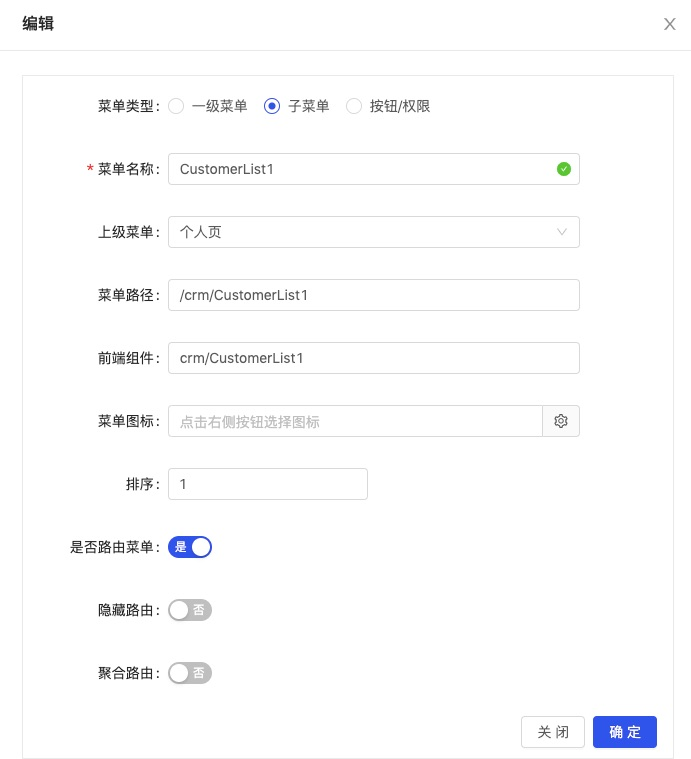
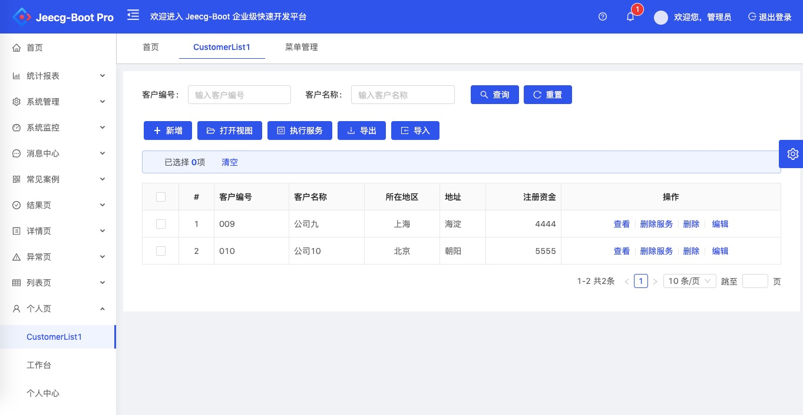

## 快速入门
快速入门以Jeecg-Boot快速开发框架为例。

1. 从[BizMDA](https://github.com/szhengye/BizMDA)中Clone下载项目源码；
2. 在Eclipse或IDEA中作为MAVEN项目导入；
3. 设置```modal/mda.yml```中代码和资源文件输出目录：
```yaml
#代码作者名
author: Steven
#代码作者邮箱
email: steven@bizmda.com
#版本号
version: V1.0
#生成代码所属java包名
packageName: com.bizmda
#生成代码文件所在目录
sourcePath: tmp/src
#生成资源文件所在目录
resourcePath: tmp/resource
#生成代码所用的模板名
template: Jeecg-Boot
```
> 主要需要设置参数：
>
> "sourcePath"和"resourcePath"这2个参数——分别对应代码文件和资源文件的生成输出目录；
>
> "template"——指定使用Jeecg-Boot模板进行代码生成，这套代码只适用用Jeecg Boot框架。
4. 数据建模，在`model/data`目录下增加customer(顾客)实体的数据建模文件`customer.yml`

   ```yaml
   #表名
   name: customer
   #标签
   label: 客户
   #所属模块
   module: crm
   #主键
   primaryKey: cust_no
   #主键生成规则（MANUAL-手工输入(缺省) UUID-UUID AUTO_INCREMENT-自增）
   primaryKeyType: UUID
   #是否物理删除,会自动生成mda_status域（0正常 1删除 2停用）
   hasStatus: false
   #是否跟踪创建和更新，会自动生成create_by,create_date,update_by,update_date
   hasCreateUpdate: false
   #域列表
   fields:
      #域名
    - name: cust_no
      #域标签
      label: 客户编号
      #数据类型：int,float,decimal(19,2)-money,date,datetime,tinyint-boolean,varchar(100),char(10),blob
      type: char(32)
      #输入类型：text,textarea,checkbox,radiobox,select
      showType: text
      #相关字典名
      dictName:
      #允许为空
      isNull: false
    - name: cust_name
      label: 客户名称
      type: varchar(20)
      showType: text
      isNull: false
    - name: cust_region
      #域标签
      label: 所在地区
      #数据类型：int,float,decimal(19,2)-money,date,datetime,tinyint-boolean,varchar(100),char(10),blob
      type: varchar(5)
      #输入类型：text,textarea,checkbox,radiobox,select
      showType: select
      #相关字典名
      dictName: region
      #允许为空
      isNull: true
    - name: cust_address
      #域标签
      label: 地址
      #数据类型：int,float,decimal(19,2)-money,timestamp,tinyint-boolean,varchar(100),char(10),blob
      type: varchar(100)
      #输入类型：text,textarea,checkbox,radiobox,select
      showType: text
    - name: cust_registered_capital
      #域标签
      label: 注册资金
      #数据类型：int,float,decimal(19,2)-money,timestamp,tinyint-boolean,varchar(100),char(10),blob
      type: decimal(19,2)
      #输入类型：text,textarea,checkbox,radiobox,select
      showType: text
      #允许为空
      isNull: true
   ```

   > 主要设置参数：
   >
   > 数据实体属性——表名、主键等；
   >
   > 数据实体项下各数据域属性——包括域存储属性和视图呈现属性。

5. 视图建模，在`model/view`目录下增加customer(顾客)实体的列表样式视图建模文件`customer-list.yml`

   ```yaml
   #视图名称
   name: customer-list
   #标签
   label: 客户列表
   #所属模块
   module: crm
   #视图展现模块
   model: VIEW-QUERY-LIST1
   #查询条件域列表
   components:
     #相关数据表
     - dataName: customer
       #视图扩展属性
       view:
         #视图类型：QUERY、MASTER、DETAIL
         type: QUERY
       fields:
         #域名
       - name: cust_no
         #视图扩展属性
         view:
           #提示信息
           placeholder: 输入客户编号
           #查询条件类型: EQ GE LE LIKE BETWEEN
           queryType: EQ
           #跨度
           span: 6
         #域名
       - name: cust_name
         view:
           #提示信息
           placeholder: 输入客户名称
           #查询条件类型: EQ GE LE LIKE BETWEEN
           queryType: EQ
           #跨度
           span: 6
       actions:
     #相关数据表
     - dataName: customer
       #视图扩展属性
       view:
         #视图类型：QUERY、MASTER、DETAIL
         type: LIST
       fields:
         #域名
         - name: cust_no
         #视图扩展属性
           view:
           #提示信息
             placeholder: 输入客户编号
         - name: cust_name
           view:
             #提示信息
             placeholder: 输入客户名称
         - name: cust_region
         - name: cust_address
         - name: cust_registered_capital
       actions:
     #相关数据表
     - dataName: customer
       #视图扩展属性
       view:
         #视图类型：QUERY、MASTER、DETAIL
         type: MODAL
       fields:
         #域名
         - name: cust_no
         - name: cust_name
         - name: cust_region
         - name: cust_address
         - name: cust_registered_capital
       actions:
   ```

   > 主要设置参数：
   >
   > 视图属性——视图名称、视图采用的样式模板等；
   >
   > 视图项下组件属性——一个视图包括多个组件，这里会设置组件关联的数据实体以及组件的样式参数等；
   >
   > 组件项下域属性——一个组件会包括多个域（从组件关联的数据实体和服务实体中选择），这里会设置域的视图样式。

6. 运行```src/com/bizmda/CodeGen.java```；

7. 你可以在你所设置的代码和资源文档输出目录（根据`mda.yml`的设置，代码输出目录为当前项目目录的`tmp/src`，资源文件输出目录为`tmp/resource`）中，看到生成的代码和资源文档；

8. 用生成的tmp/resource/db/crm/customer.sql文件，在Jeecg-Boot框架项目关联的MySQL数据库中，创建customer表；

9. 把生成的tmp/src目录下所有文件，拷贝到Jeecg-Boot项目中的jeecg-boot/src/main/java目录中；

10. 把生成的tmp/resource/views目录下所有文件，拷贝到Jeecg-Boot项目中的ant-design-jeecg-vue/src/views目录中；

11. 在Jeecg-Boot项目启动类JeecgApplication.java中，增加并修改以下二行：

    ```java
    @ComponentScan({"org.jeecg","com.bizmda"})
    @MapperScan({"com.bizmda.**.mapper"})
    ```

12. 启动Jeecg-Boot，在菜单管理中配置CustomerList.vue的菜单入口，并配置针对此菜单的使用权限；




13. 重新登录后，即可点击刚才配置好的菜单入口，呈现针对customer表的增、删、改、查功能。

