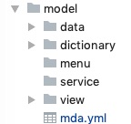

## 建模

建模文件位置在BizMDA项目的model文件夹中：

 

主要包括以下文件和文件夹：
* mda.yml：项目参数文件
* 模板目录: 目录名称即为`mda.yml`文件中定义的template，下面存放建模文件，包括：
  * /data：数据建模文件目录
  * /view：视图建模文件目录
  * /menu：菜单建模文件目录
  * /service：服务建模文件目录
  * /dictionary：字典建模文件目录

