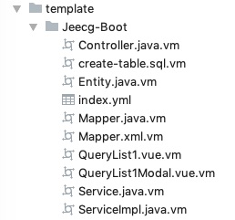
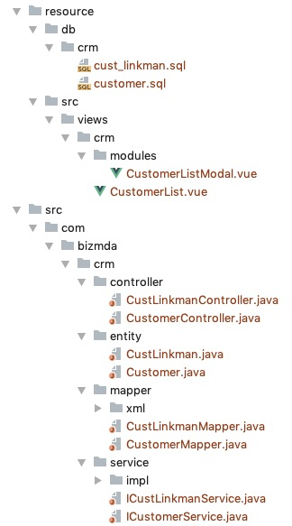
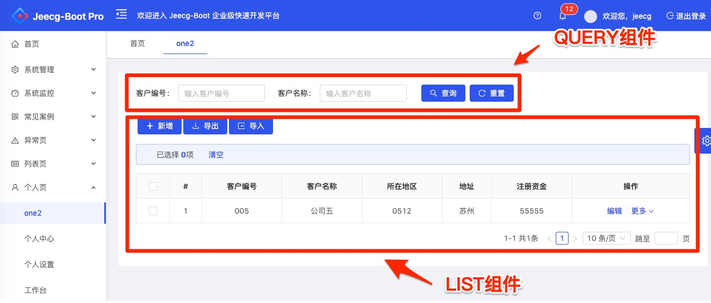
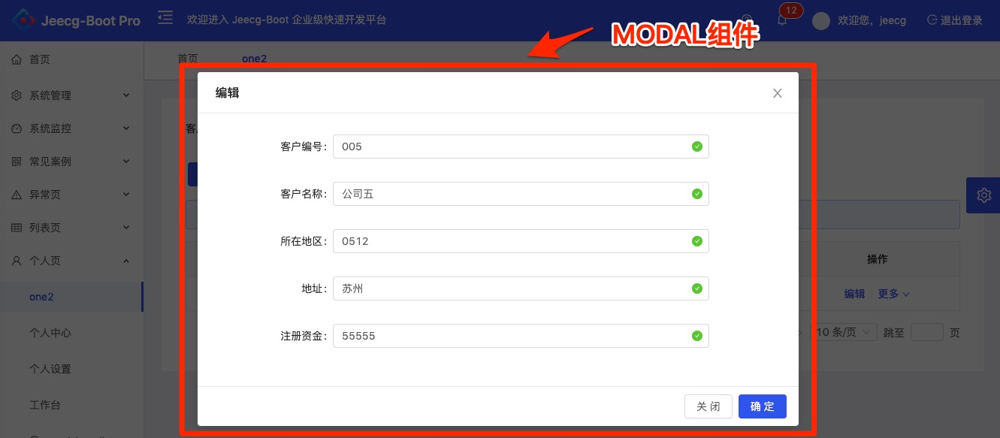

## Jeecg-Boot快速开发框架
[JeeCG-Boot快速开发框架](https://github.com/zhangdaiscott/jeecg-boot)：Jeecg-boot 是一款基于代码生成器的智能开发平台! 采用前后端分离技术:SpringBoot，Mybatis-plus，Shiro，JWT，Vue & Ant Design。
Jeecg-Boot框架的模板名为“Jeecg-Boot”，所有模板位于`template/Jeecg-Boot`目录下：

### index.yml
描述Jeecg-Boot框架所有待生成文件：
```yaml
name: Jeecg-Boot快速开发框架
templates:
   #数据Entity实体类
 - file: Entity.java.vm
   model: data
   target: ${mda.sourcePath}/${mda.packagePath}/${module}/entity/${className}.java
   #数据映射类
 - file: Mapper.java.vm
   model: data
   target: ${mda.sourcePath}/${mda.packagePath}/${module}/mapper/${className}Mapper.java
   #数据映射配置文件
 - file: Mapper.xml.vm
   model: data
   target: ${mda.sourcePath}/${mda.packagePath}/${module}/mapper/xml/${className}Mapper.xml
   #数据服务接口
 - file: Service.java.vm
   model: data
   target: ${mda.sourcePath}/${mda.packagePath}/${module}/service/I${className}Service.java
   #数据服务实现类
 - file: ServiceImpl.java.vm
   model: data
   target: ${mda.sourcePath}/${mda.packagePath}/${module}/service/impl/${className}ServiceImpl.java
   #数据控制类
 - file: Controller.java.vm
   model: data
   target: ${mda.sourcePath}/${mda.packagePath}/${module}/controller/${className}Controller.java
   #数据相关建表SQL文件
 - file: create-table.sql.vm
   model: data
   target: ${mda.resourcePath}/db/${module}/${name}.sql
   #数据列表VUE页面文件（带查询条件和分页，包括数据增、删、改，多条删除，以及EXCEL文件导入、导出，新增和编辑操作为弹出modal窗口）
 - file: QueryList1.vue.vm
   model: VIEW-QUERY-LIST1
   target: ${mda.resourcePath}/src/views/${module}/${className}.vue
   #数据列表的弹出modal窗口数据编辑VUE页面文件
 - file: QueryList1Modal.vue.vm
   model: VIEW-QUERY-LIST1
   target: ${mda.resourcePath}/src/views/${module}/modules/${className}Modal.vue
```
根据以上配置，生成的文件（包括代码和资源文件），如下图所示：

其中，Entity.java.vm、Mapper.java.vm、Mapper.xml.vm、Service.java.vm、ServiceImpl.java.xm、Controller.java.vm模板生成相关文件的使用，请参见Jeecg-Boot框架的[技术文档](http://jeecg-boot.mydoc.io)。
### QueryList1.vue.vm & QueryList1Modal.vue.vm
QueryList1.vue.vm模板文件生成数据列表VUE页面文件（带查询条件和分页，包括数据增、删、改，多条删除，以及EXCEL文件导入、导出，新增和编辑操作为弹出modal窗口）.
QueryList1Modal.vue.vm模板文件生成数据列表的弹出modal窗口数据编辑VUE页面文件。

配置文件如下例：
```yaml
#视图名称
name: customer-list
#标签
label: 客户列表
#所属模块
module: crm
#视图展现模块
model: VIEW-QUERY-LIST1
#查询条件域列表
components:
  #视图类型：查询条件组件
  - type: QUERY
    #相关数据表
    dataName: customer
    #视图扩展属性
    view:
    fields:
      #域名
    - name: cust_no
      #视图扩展属性
      view:
        #提示信息
        placeholder: 输入客户编号
        #查询条件类型: EQ GE LE LIKE BETWEEN
        queryType: EQ
        #跨度
        span: 6
      #域名
    - name: cust_name
      view:
        #提示信息
        placeholder: 输入客户名称
        #查询条件类型: EQ GE LE LIKE BETWEEN
        queryType: EQ
        #跨度
        span: 6
    actions:
    #视图类型：数据列表组件
  - type: LIST
    #相关数据表
    dataName: customer
    #视图扩展属性
    view:
    fields:
      #域名
      - name: cust_no
      #视图扩展属性
        view:
        #提示信息
          placeholder: 输入客户编号
      - name: cust_name
        view:
          #提示信息
          placeholder: 输入客户名称
      - name: cust_region
      - name: cust_address
      - name: cust_registered_capital
    actions:
    #视图类型：弹出编辑modal窗口组件
  - type: MODAL
    #相关数据表
    dataName: customer
    #视图扩展属性
    view:
    fields:
      #域名
      - name: cust_no
      - name: cust_name
      - name: cust_region
      - name: cust_address
      - name: cust_registered_capital
    actions:
```
在视图中涉及到QUERY、LIST、MODAL共3个component（组件），效果如下：


