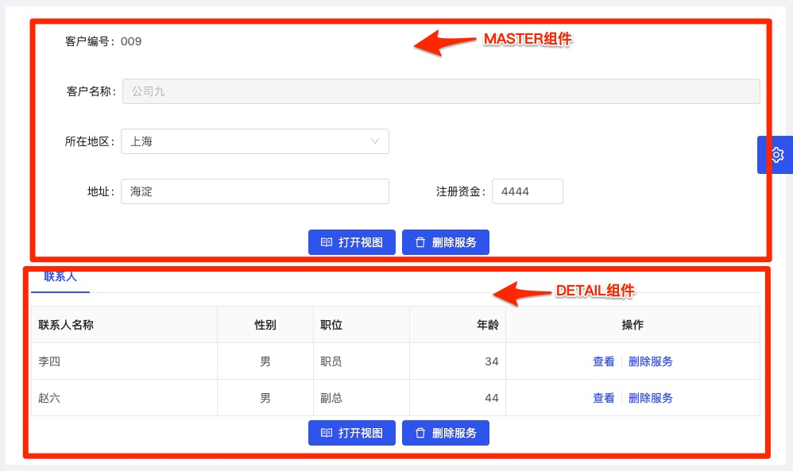

### VIEW模板:FORM-1
模板**FORM-1**包含主表的单记录表单页面和多个子表的数据列表，支持主表数据修改、删除、服务执行等操作，以及子表的查阅、修改、删除等操作。

配置文件如下例（customer-form-1.yml）：

```yaml
#标签
label: 客户列表
#视图展现模块
model: FORM-1
#查询条件域列表
components:
    #视图类型：FORM表单组件
  - type: MASTER
    #相关数据表
    tableName: customer
    #视图扩展属性
    view:
    fields:
      #域名
      - name: cust_no
        view:
          span: 12
          showType: text
      - name: cust_name
        view:
          span: 24
          showType: disabled
      - name: cust_region
        view:
          span: 12
          newLine: true
      - name: cust_address
        view:
          span: 12
      - name: cust_registered_capital
        view:
          span: 8
    actions:
      - type: OPEN-VIEW
        label: 打开视图
        icon: read
        params:
          view: /crm/CustomerForm1
          query: "{'mda.id': record.custNo}"
      - type: DO-SERVICE
        label: 删除服务
        icon: delete
        params:
          method: delete
          url: /crm/customer/delete
          data: "{id: record.custNo}"
    #视图类型：明细表组件
  - type: DETAIL
    #相关数据表
    tableName: cust_linkman
    #视图扩展属性
    view:
    fields:
      #域名
      - name: link_name
        view:
          span: 5
      - name: link_sex
        view:
          span: 4
      - name: link_position
        view:
          span: 6
      - name: link_age
        view:
          span: 3
    actions:
      - type: OPEN-VIEW
        label: 打开视图
        icon: read
        params:
          view: /crm/CustLinkmanForm1
          query: "{'mda_id': record.linkCustNo}"
      - type: DO-SERVICE
        label: 删除服务
        icon: delete
        params:
          method: delete
          url: /crm/customer/delete
          data: "{id: record.custNo}"
      - type: LIST-OPEN-VIEW
        label: 查看
        icon: read
        params:
          view: /crm/CustLinkmanForm1
          query: "{mda_id: record.linkNo}"
      - type: LIST-DO-SERVICE
        label: 删除服务
        icon: delete
        params:
          method: delete
          url: /crm/customer/delete
          data: "{id: record.custNo}"
```
在视图中涉及到MASTER、DETAIL共2个component（组件），效果如下：


