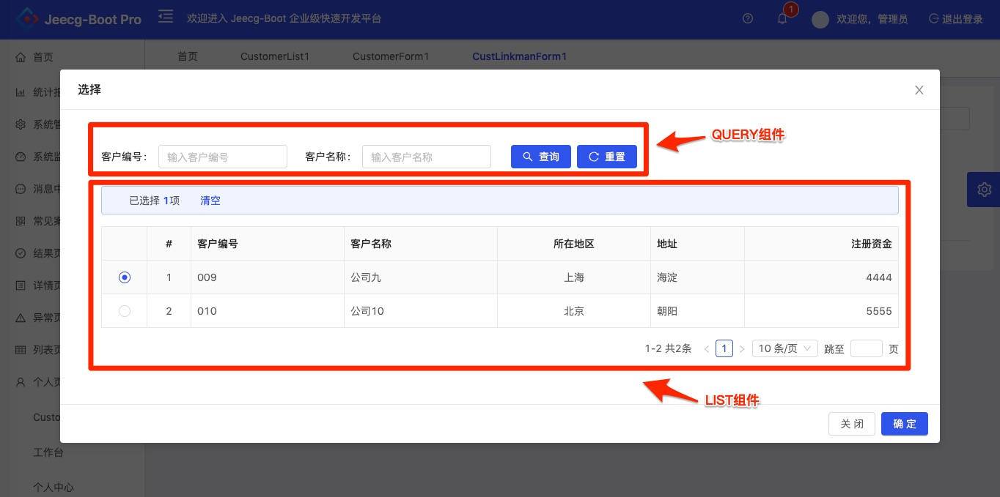

### VIEW模板:LOOKUP
模板**LOOKUP**主要是生成针对LOOKUP类型域的，可选择回填的LOOKUP列表。

配置文件如下例（customer-lookup.yml）：

```yaml
#标签
label: 客户列表
#视图展现模块
model: LOOKUP
#视图扩展属性
view:
  width: 1200
  lookupFieldDesc: record.custName
#查询条件域列表
components:
  #视图类型：查询条件组件
  - type: QUERY
    #相关数据表
    tableName: customer
    #视图扩展属性
    view:
    fields:
      #域名
    - name: cust_no
      #视图扩展属性
      view:
        #提示信息
        placeholder: 输入客户编号
        #查询条件类型: EQ GE LE LIKE BETWEEN
        queryType: EQ
        #跨度
        span: 6
      #域名
    - name: cust_name
      view:
        #提示信息
        placeholder: 输入客户名称
        #查询条件类型: EQ GE LE LIKE BETWEEN
        queryType: EQ
        #跨度
        span: 6
    actions:
    #视图类型：数据列表组件
  - type: LIST
    #相关数据表
    tableName: customer
    #视图扩展属性
    view:
    fields:
      #域名
      - name: cust_no
      #视图扩展属性
        view:
        #提示信息
          placeholder: 输入客户编号
      - name: cust_name
        view:
          #提示信息
          placeholder: 输入客户名称
      - name: cust_region
      - name: cust_address
      - name: cust_registered_capital
    actions:
```
在视图中涉及到QUERY、LIST共2个component（组件），效果如下：


