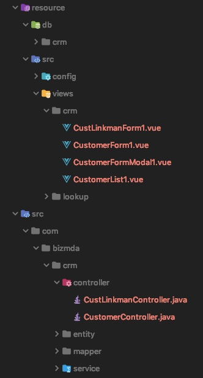

Jeecg-Boot框架的模板名为“Jeecg-Boot”，所有模板位于`template/Jeecg-Boot`目录下：


### index.yml
描述Jeecg-Boot框架所有待生成文件：
```yaml
name: Jeecg-Boot快速开发框架
templates:
   #数据Entity实体类
 - file: Entity.java.vm
   model: data
   target: ${mda.sourcePath}/${mda.packagePath}/${modulePath}/entity/${className}.java
   #数据映射类
 - file: Mapper.java.vm
   model: data
   target: ${mda.sourcePath}/${mda.packagePath}/${modulePath}/mapper/${className}Mapper.java
   #数据映射配置文件
 - file: Mapper.xml.vm
   model: data
   target: ${mda.sourcePath}/${mda.packagePath}/${modulePath}/mapper/xml/${className}Mapper.xml
   #数据服务接口
 - file: Service.java.vm
   model: data
   target: ${mda.sourcePath}/${mda.packagePath}/${modulePath}/service/I${className}Service.java
   #数据服务实现类
 - file: ServiceImpl.java.vm
   model: data
   target: ${mda.sourcePath}/${mda.packagePath}/${modulePath}/service/impl/${className}ServiceImpl.java
   #数据控制类
 - file: Controller.java.vm
   model: data
   target: ${mda.sourcePath}/${mda.packagePath}/${modulePath}/controller/${className}Controller.java
   #数据相关建表SQL文件
 - file: create-table.sql.vm
   model: data
   target: ${mda.resourcePath}/db/${modulePath}/${name}.sql
   #字典文件加载JS文件
 - file: dictionary.js.vm
   model: dicts
   target: ${mda.resourcePath}/src/config/MdaDictionary.js
   #数据列表VUE页面文件（带查询条件和分页，包括数据增、删、改，多条删除，以及EXCEL文件导入、导出）
 - file: List1.vue.vm
   model: LIST-1
   target: ${mda.resourcePath}/src/views/${modulePath}/${className}.vue
   #数据表单，支持明细子表
 - file: Form1.vue.vm
   model: FORM-1
   target: ${mda.resourcePath}/src/views/${modulePath}/${className}.vue
   #弹出数据表单新增/编辑的modal页面
 - file: FormModal1.vue.vm
   model: FORM-MODAL-1
   target: ${mda.resourcePath}/src/views/${modulePath}/${className}.vue
   #Lookup列表VUE页面文件（带查询条件和分页）
 - file: Lookup.vue.vm
   model: LOOKUP
   target: ${mda.resourcePath}/src/views/${modulePath}/${className}.vue
```
根据以上配置，生成的文件（包括代码和资源文件），如下图所示：

其中，Entity.java.vm、Mapper.java.vm、Mapper.xml.vm、Service.java.vm、ServiceImpl.java.xm、Controller.java.vm模板生成相关文件的使用，请参见Jeecg-Boot框架的[技术文档](http://jeecg-boot.mydoc.io)。
