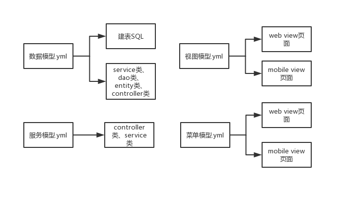

## BizMDA建模思路

BizMDA是一个基于模型驱动架构的商业应用开发平台，支持多种开发框架，通过数据建模、视图建模、服务建模、菜单建模等针对商业应用的建模，来快速支持WEB应用、APP应用和小程序的开发。

### 数据模型.yml
数据模型.yml相关的配置文件都位于`modal/data`目录下，针对每个yml文件，都会被看成是应用的一个数据实体，会生成一系列文件。
具体要生成什么文件，在开发框架模板目录下`index.yml`文件中来约定（model属性为“data”的文件，都是会根据数据模型定义来生成的）。

### 视图模型.yml
视图模型.yml相关的配置文件都位于`model/view`目录下，针对每个yml文件，都会被看成是应用的一个视图实体（这里一个视图实体，可能会对应多个页面，主要是看视图中model属性的约定）。

具体对应生成的文件，在指定开发框架模板目录下`index.yml`文件来约定，是通过`index.yml`中的生成文件model属性来匹配的。
